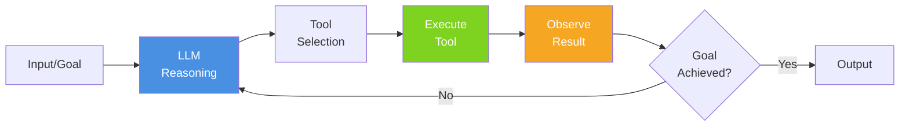
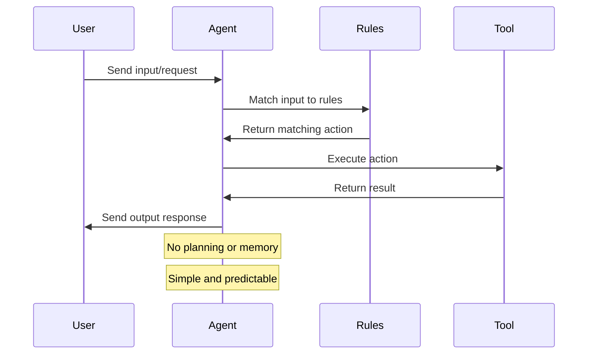
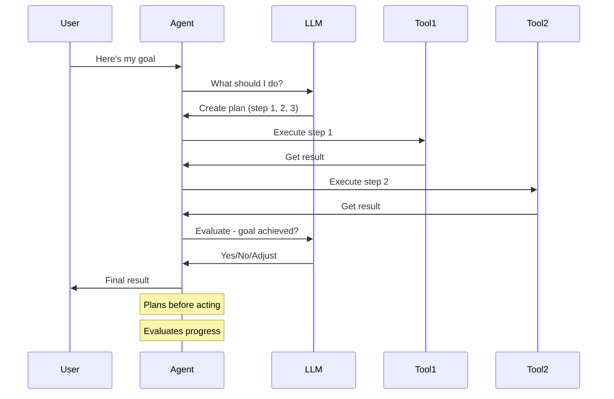
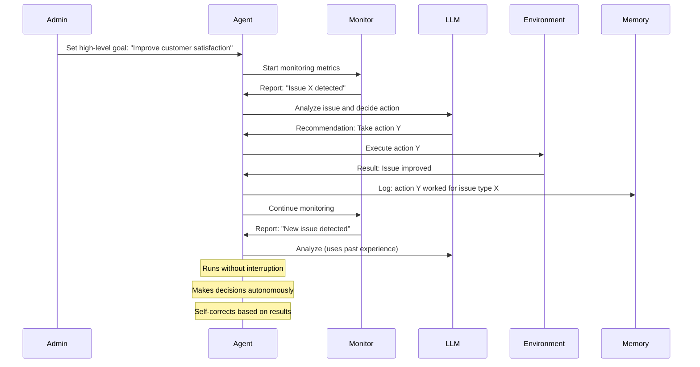
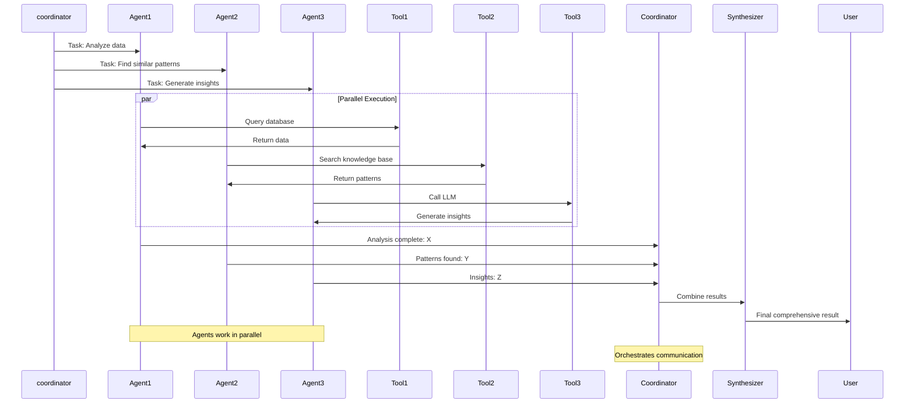
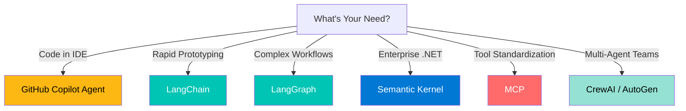
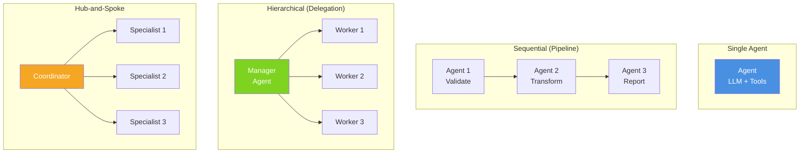
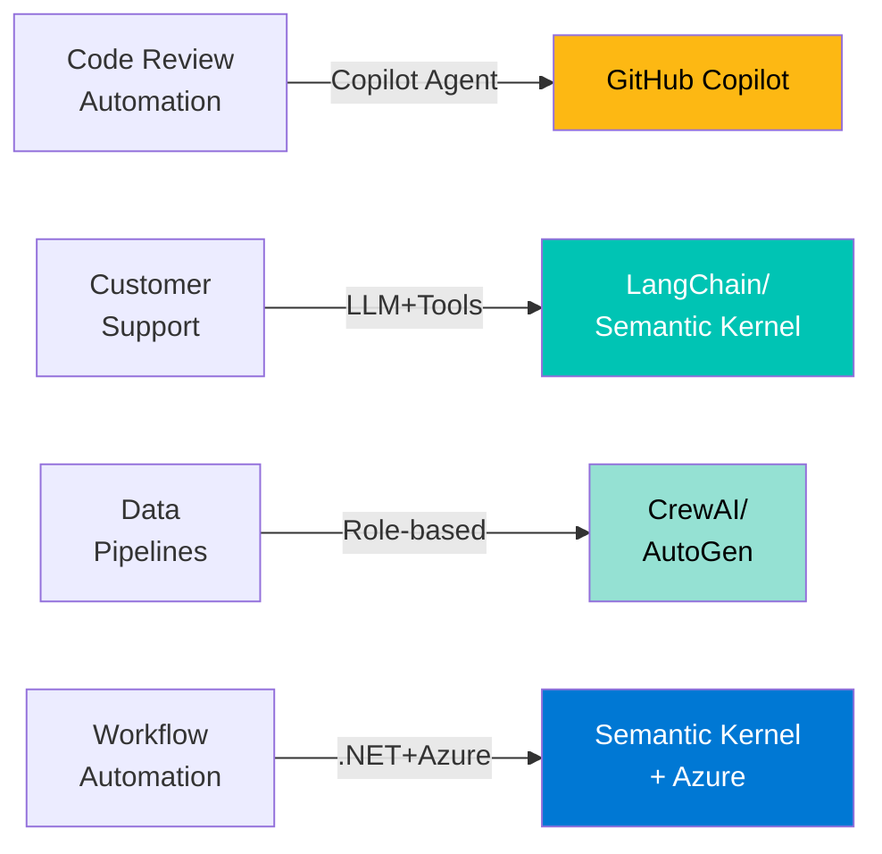

# AI Agents Ecosystem: Quick-Start Overview

## Table of Contents
1. [Introduction & Motivation](#1-introduction--motivation)
2. [What is an AI Agent?](#2-what-is-an-ai-agent)
3. [Core Concepts in Plain Language](#3-core-concepts-in-plain-language)
4. [Types of AI Agents in the Ecosystem](#4-types-of-ai-agents-in-the-ecosystem)
5. [Framework Landscape Simplified](#5-framework-landscape-simplified)
6. [Architecture Patterns Visualized](#6-architecture-patterns-visualized)
7. [Enterprise Use Cases](#7-enterprise-use-cases)
8. [Key Takeaways](#8-key-takeaways)
9. [References & Learning Resources](#9-references--learning-resources)

---

## 1. Introduction & Motivation

Artificial Intelligence is undergoing a fundamental shift. For years, we've interacted with AI through simple API calls: send a prompt, get a response. But the future is about **autonomous agents**—AI systems that can think, plan, take action, and learn from results without constant human intervention.

An AI agent is more than just a language model. It's a reasoning system that:
- **Perceives** its environment and incoming information
- **Reasons** about what to do using its understanding
- **Acts** by calling tools, APIs, or services
- **Observes** the results and adapts its strategy

This shift enables powerful new capabilities: customer service bots that solve problems without human escalation, data processing pipelines that make intelligent decisions, code review systems that reason about architecture, and enterprise workflows that coordinate across multiple systems.

Understanding the agentic AI ecosystem is essential for architects and engineers building intelligent systems. This document provides a high-level overview of what agents are, how they work, and which tools and frameworks are available.

---

## 2. What is an AI Agent?

### Definition
An **AI Agent** is an autonomous entity powered by a large language model (LLM) that can:
- Understand goals and context from users or other systems
- Reason about available tools and resources
- Make decisions about what actions to take
- Execute those actions (calling APIs, querying databases, invoking functions)
- Observe results and adapt its approach

### Key Components



**Diagram 1: Single Agent Reasoning Loop**

The core loop is simple:
1. **Perceive**: Receive the user's goal or incoming context
2. **Reason**: The LLM thinks about what to do using its knowledge and available tools
3. **Act**: Call a tool, API, or function to take action in the world
4. **Observe**: Get the result and incorporate it into understanding
5. **Loop**: Go back to reasoning until the goal is complete

### Single Agent vs. Multi-Agent at a Glance

**Single Agent**: One LLM-powered entity handles the entire task. Simple, focused, good for well-defined problems.

**Multi-Agent**: Multiple agents with different specialties work together. One agent might validate data, another transforms it, another generates reports. More powerful but more complex.

---

## 3. Core Concepts in Plain Language

### Memory
Agents need to remember things. There are three types:

- **Short-term Memory**: The current conversation context. "What did the user just ask?" This is typically the most recent messages and active reasoning state.
- **Long-term Memory**: Knowledge stored externally (vector databases, documents, knowledge bases). Used for retrieval-augmented generation (RAG). "What do I know about this company's policies?"
- **Working Memory**: Intermediate states during reasoning. Like a "scratch pad" where the agent works through logic, stores intermediate results, or builds up a complex plan.

### Observability
You can't improve what you can't measure. In agentic systems, observability means:

- **Tracing**: Seeing exactly what decisions the agent made and why (which tools it called, what reasoning it followed)
- **Logging**: Recording what happened at each step (structured logs, not just text)
- **Metrics**: Measuring success rates (tool success rate, latency, token usage, reasoning depth)
- **Debugging**: Being able to reproduce and step through agent behavior to understand failures

### Tools & Functions
Tools are how agents take action. Examples:
- **APIs**: Call external services (payment processors, weather APIs, internal business APIs)
- **Functions**: Execute code or stored procedures
- **Databases**: Query or write data
- **File Operations**: Read/write files
- **Custom Tools**: Any callable action you define

### Reasoning Patterns
How does an agent think?

- **ReAct (Reasoning + Acting)**: Think about what to do, then do it, then observe. The most common pattern—works well for most problems.
- **Chain of Thought (CoT)**: Break complex problems into steps and reason through each one explicitly. Helps with accuracy on hard problems.

### Multi-Agent Coordination
When multiple agents work together, they need to:
- **Communicate** what they're doing and what they've learned
- **Coordinate** to avoid duplicate work and ensure correct sequencing
- **Handle errors** gracefully if one agent fails
- **Share state** (what has been done, what information was discovered)

---

## 4. Types of AI Agents in the Ecosystem

Different types of agents are designed for different problems. Understanding the type of agent you're building helps you choose the right framework and architecture.

### Reactive Agents

Reactive agents respond immediately to inputs without planning or reasoning about future states. They're simple, fast, and perfect for well-defined, straightforward tasks.

**Design**: Input → Pattern Matching → Action → Output



**Diagram 5: Reactive Agent Sequence**

Components used: LLM (for pattern matching), Rules engine, Tool registry, Output formatter.

Best for: Quick responses, FAQ bots, simple command execution, real-time data retrieval.

### Deliberative Agents

Deliberative agents plan before acting. They think about the goal, consider available actions, create a plan, and then execute it step by step. More complex but more intelligent.

**Design**: Perceive → Plan → Execute → Evaluate → Adjust



**Diagram 6: Deliberative Agent Sequence**

Components used: LLM (reasoning and planning), Memory (stores plan), Tools (execute plan steps), Evaluator (checks progress).

Best for: Complex problem solving, multi-step workflows, content creation, analysis tasks. Frameworks: LangChain, Semantic Kernel, LangGraph.

### Learning Agents

Learning agents improve their behavior based on experience. They observe outcomes, store what worked and what didn't, and adjust their approach over time. Sophisticated but require feedback mechanisms.

**Design**: Act → Observe → Learn → Update → Act Better

```mermaid
sequenceDiagram
    Agent->>Tool: Execute action A
    Tool->>Agent: Get result (success/failure)
    Agent->>Memory: Store: "Action A with context X = success"
    Agent->>LLM: Analyze outcome
    LLM->>Agent: Learn: when context is X, action A is good
    Agent->>Memory: Update knowledge base
    
    next_time: Next time similar context appears
    Agent->>Memory: Retrieve learned experience
    Memory->>Agent: Action A worked before in similar cases
    Agent->>Tool: Try action A again
    Tool->>Agent: Result
    
    Note over Agent: Improves with each interaction
    Note over Agent: Stores and applies lessons
```

**Diagram 7: Learning Agent Sequence**

Components used: LLM (reasoning about outcomes), Long-term memory (knowledge store), Feedback mechanism (track success/failure), Experience database.

Best for: Personalization, optimization, long-term improvement, adaptive systems. Frameworks: Advanced LangChain, Semantic Kernel with persistent memory.

### Autonomous Agents

Autonomous agents operate independently with minimal human intervention. They set their own goals based on high-level objectives, take actions in their environment, monitor outcomes, and adapt without waiting for approval at each step.

**Design**: Initialize Goal → Monitor → Decide → Act → Loop Until Goal Met



**Diagram 8: Autonomous Agent Sequence**

Components used: LLM (independent reasoning), Environment monitor (real-time feedback), Action executor, Memory (experience), Goal tracker.

Best for: Continuous operations, system monitoring, optimization tasks, automated response systems. Frameworks: Semantic Kernel, AutoGen, LangGraph.

### Multi-Agent Systems

Multiple agents with different roles collaborate to solve complex problems. Agents communicate, share information, and coordinate their actions.

**Design**: Agents communicate → Coordinate → Execute in parallel → Synthesize results



**Diagram 9: Multi-Agent System Sequence**

Components used: Orchestrator (manages communication), Individual agents (each with role), Communication protocol (how agents share info), Result synthesizer.

Best for: Large complex problems, content pipelines, data analysis, business process automation. Frameworks: CrewAI, AutoGen, LangGraph.

### Comparison of Agent Types

| Agent Type | Complexity | Speed | Adaptability | Best Use Case | Framework Examples |
|-----------|-----------|-------|--------------|--------------|-------------------|
| Reactive | Low | Very Fast | None | Quick responses, simple tasks | GitHub Copilot Agent, basic LangChain |
| Deliberative | Medium | Medium | Plan adjustment | Problem-solving, multi-step workflows | LangChain, Semantic Kernel |
| Learning | High | Medium | High (improves over time) | Personalization, optimization | Advanced LangChain, SK with memory |
| Autonomous | High | Varies | Very high | Continuous operations, auto-response | Semantic Kernel, LangGraph |
| Multi-Agent | High | Medium-Fast | High (via collaboration) | Complex problems, pipelines | CrewAI, AutoGen, LangGraph |

---

## 5. Framework Landscape Simplified

The agentic AI world has many tools. Here's a quick overview of the major frameworks:



**Diagram 2: Framework Selection Decision Tree**

| Framework | Best For | Complexity | Language Support |
|-----------|----------|-----------|------------------|
| **GitHub Copilot Agent** | IDE-based coding tasks | Low | TypeScript/Python in IDE |
| **LangChain** | Rapid prototyping, RAG, multi-step workflows | Medium | Python (LangChain.js for JS/TS) |
| **LangGraph** | Complex workflows, state machines, conditional routing | Medium-High | Python |
| **Semantic Kernel** | Enterprise .NET/Azure environments | Medium | C#/.NET, Python |
| **MCP** | Standardizing tool access across agents | Low-Medium | Python, Node.js, any language |
| **AutoGen** | Code generation, collaborative agents | Medium | Python |
| **CrewAI** | Role-based agent teams | Medium | Python |

### What Each Tool Actually Does & Why to Use Them

#### GitHub Copilot Agent

- **What it is**: This is AI intelligence that runs directly inside VS Code and GitHub. You don't need to install anything extra or manage API keys separately. It's built right into the tools you're already using as a developer.

- **How it works**: When you select some code and ask Copilot a question, it reads your code context and reasons about what you're asking. It can understand the specific patterns in your project, the libraries you're using, and your coding style, so it gives answers tailored to your exact situation.

- **Key features**: You can ask it to review your code for bugs or style issues, generate documentation for your functions, suggest refactoring opportunities, explain architectural decisions, or help you understand what existing code does. It all happens without leaving your editor.

- **Basic concept**: The power comes from context awareness. Unlike a generic chatbot, Copilot knows your specific codebase, so it gives smarter, more relevant answers. It's like having a senior developer review your work right there in VS Code.

- **Core components**: The LLM reasoning engine (understands your questions), context understanding (reads your code), prompt generation (creates the right request to send), and the editor integration (makes it seamless in VS Code).

- **When to use it**: This is perfect if you already have GitHub Copilot and want to extend it beyond general coding help. You can write custom instructions files that tell Copilot about your specific architectural rules, coding standards, or domain expertise.

- **Best for and Getting started**: Individual developers and small teams who want AI assistance without learning a new framework or dealing with complex setup. Just install the Copilot extension, and optionally create a .github/copilot-instructions.md file to customize how it behaves for your team's specific needs.

#### LangChain

- **What it is**: LangChain is a Python library that makes building AI agents much easier by providing pre-built components for common tasks. Instead of writing integration code for each tool your agent needs, LangChain has ready-made connectors that handle the details.

- **How it works**: You build agents by chaining together operations. For example: retrieve documents from a database, summarize them, call an API with the summary, and format the results. Each step is a component you pick from LangChain's library or create yourself.

- **Key features**: It has pre-built connectors to over 100 external services including databases, search engines, APIs, file systems, email services, and more. It also has built-in support for RAG (Retrieval-Augmented Generation), which means your agent can search a knowledge base and use those results to answer questions. Memory management is built in so your agent can remember conversation history.

- **Basic concept**: Instead of writing the integration code that connects your agent to databases, APIs, and other tools, LangChain handles the plumbing. This lets you focus on the agent logic itself. You can prototype an agent in a few hours instead of spending days writing integration code.

- **Core components**: Chains (sequences of operations), Agents (entities that make decisions about what to do), Memory (stores conversation history and context), Tools (the functions your agent can call), and Connectors (handle communication with external services).

- **When to use it**: Use LangChain when you want to prototype quickly, need to integrate with many different services, or you prefer working in Python. It's the most popular choice for building AI agents because the ecosystem is huge and you'll find examples for almost any task.

- **Best for and Getting started**: Rapid prototyping, proof-of-concepts, and teams that value having lots of ready-made integrations. Start by installing LangChain with pip, then create simple chains first. Once you understand how chains work, gradually add agents and more complex logic.

#### LangGraph

- **What it is**: LangGraph is a workflow engine built on top of LangChain that lets you define exactly how your agent should behave. Instead of letting the agent decide dynamically, you explicitly map out all the possible paths it can take.

- **How it works**: You create a graph where each node is a function that does some work, and edges connect the nodes showing how to move from one step to the next. Think of it like a flowchart for your agent. The agent follows this exact structure every time it runs, making behavior predictable and testable.

- **Key features**: It guarantees deterministic execution, meaning the same input will always produce the same path through the workflow. You can persist state between steps so information isn't lost. You can define conditional routing, so the agent takes different paths based on the current state. It supports streaming, so you can see results as they happen instead of waiting for everything to complete.

- **Basic concept**: While LangChain gives your agent lots of freedom to decide what to do, LangGraph takes control. You say "first do step A, then decide between step B and C based on the result, then do step D." This makes complex workflows explicit and easy to understand. It's ideal for production systems where unpredictable behavior would be a problem.

- **Core components**: Nodes (functions that do the actual work), Edges (define transitions between nodes), State (persistent data that flows through the graph), and Graphs (the complete workflow structure that ties everything together).

- **When to use it**: Use LangGraph when you need predictable behavior, are building production systems where reliability matters, or want to clearly visualize how your agent makes decisions. It's also great when you have a complex multi-step process that you want to ensure always follows the same logic.

- **Best for and Getting started**: Complex workflows, deterministic execution, and teams that need clear visibility into how their agent works. Start with LangChain first to understand the basics. When you hit the limits of LangChain's flexibility and want more structure, graduate to LangGraph.

#### Semantic Kernel

- **What it is**: Semantic Kernel is Microsoft's framework for building AI agents, and it's designed from the ground up for C# and .NET. Unlike other frameworks that started in Python and were ported to .NET, this is a native .NET framework with no compromises.

- **How it works**: You create Skills (functions your agent can call) and organize them into Plugins (collections of related skills). You then use the Kernel to manage these skills, handle LLM interaction, store memory, and coordinate everything. When your agent needs to do something, the Kernel figures out which skill to call and how to call it.

- **Key features**: It uses native async/await patterns throughout, so it fits naturally into C# code. It integrates seamlessly with Azure services like Azure OpenAI, Azure Cognitive Search, and Azure Cosmos DB. It supports dependency injection, so your skills can access services through the container. All plugins and skills are strongly typed, catching errors at compile time instead of runtime.

- **Basic concept**: Think of the Kernel as an orchestrator. It knows about all your skills, understands the current context, talks to the LLM, manages memory, and coordinates everything. Your skills are just C# functions that do specific things. The Kernel handles all the complexity of making them work together with the LLM.

- **Core components**: The Kernel (main orchestrator that manages everything), Plugins (collections of related skills), Functions (individual skills that do specific tasks), Memory (stores context and information for the agent to reference), and Connectors (handle communication with LLMs like Azure OpenAI).

- **When to use it**: Use Semantic Kernel if you work in a C# or .NET environment, especially if you use Azure services. It's perfect if you want strong type safety, need to integrate with existing .NET systems, or want enterprise-grade patterns like dependency injection and structured logging.

- **Best for and Getting started**: Enterprise .NET teams, Azure-focused organizations, and projects that require type safety and governance. Install it with dotnet add package Microsoft.SemanticKernel. Create your first plugin (a simple C# class with methods), then connect it to Azure OpenAI and start using it.

#### MCP (Model Context Protocol)

- **What it is**: MCP is a standardized protocol for exposing tools to AI agents in a vendor-neutral way. It's not a framework you build agents with; it's a standard way to make tools available to agents. Think of it like HTTP for tools instead of web pages.

- **How it works**: You create an MCP Server that exposes your tools (database queries, API calls, file operations, custom business logic). Any MCP Client (whether it's Copilot, Claude, or any other AI system) can connect to your server and use those tools. The protocol handles all the details of communication, error handling, and data formats.

- **Key features**: There's a standard format for defining tools so clients know what they can do and what parameters they need. Tools run securely on your server, not in the agent's environment. It's transport-agnostic, meaning you can use it over stdio (for local tools), HTTP (for remote tools), WebSocket (for streaming), or other transports. Built-in error handling means if a tool fails, the agent can recover gracefully.

- **Basic concept**: Once you expose a tool via MCP, any agent can use it. You create a USB connector for your tools instead of creating proprietary cables. This means if you have internal tools that multiple AI systems need to use, you expose them once via MCP and all agents can use them. It also means you're not locked into one vendor's agent framework.

- **Core components**: Servers (applications that expose tools), Clients (agents that consume tools), Resources (data sources that agents can access), and Tools (callable functions with defined inputs and outputs).

- **When to use it**: Use MCP when you have multiple agents that need access to the same tools, when you want to future-proof your setup against vendor lock-in, or when you're building enterprise infrastructure that multiple teams will use.

- **Best for and Getting started**: Tool standardization, future-proofing, and organizations with multiple AI systems. Define your tools in the MCP format, then expose them via any transport method. For example, if you have a database query tool, you'd expose it as an MCP Server that agents can call.

#### AutoGen

- **What it is**: AutoGen is a multi-agent framework from Microsoft Research where agents are like team members. They communicate by sending messages to each other, discussing problems, and collaborating to solve them. It's more conversational than other frameworks.

- **How it works**: Each agent has a role, capabilities, and the ability to understand messages from other agents. When you need something done, agents exchange messages. One agent might say "I've analyzed the code and found a bug," another might say "I'll fix that bug," and a third might say "I've tested the fix and it works." Workflows emerge from these conversations.

- **Key features**: AutoGen includes a built-in Python code interpreter, so agents can write, execute, and test code directly. It handles automatic code execution with error handling, so if code fails, agents can see the error and fix it. Agents can learn from execution results and improve their approach. You get flexible communication patterns, so agents can talk in ways that make sense for the problem.

- **Basic concept**: Instead of you choreographing every step, agents figure out how to collaborate. You define what each agent can do and what problem they're solving, then the agents talk to each other and solve it. This is powerful for problems where you're not sure of the exact steps needed, because agents can discuss and refine their approach.

- **Core components**: Agents (conversation participants with specific roles), ConversableAgent (the base class for agents), Tools (functions agents can call), Code execution (agents can write and run Python code), and Communication protocol (how agents send messages to each other).

- **When to use it**: Use AutoGen when you need agents to collaborate and discuss solutions, when you're solving code generation or debugging problems, or when you want flexible agent communication rather than strict choreography.

- **Best for and Getting started**: Code generation, multi-agent collaboration, research projects, and scenarios where agents need to discuss and refine solutions together. Create agents with different roles and capabilities, define the tools they can use, then start conversations and let them collaborate.

#### CrewAI

- **What it is**: CrewAI is a framework that organizes AI agents as a team with specific roles. Instead of creating generic agents, you create agents with job titles like "data analyst" or "report writer," and the framework manages who should do what task and in what order.

- **How it works**: You define your agents with specific roles and tell them what tools they can use. You create tasks that describe what needs to be done. The Crew (the team manager) looks at the tasks and figures out which agent should do each one and in what order. Agents execute their tasks, and the results flow to the next task.

- **Key features**: Agents are organized by role, so it's easy to understand what each person should do. Tasks have clear descriptions and success criteria. The framework automatically handles task delegation, so you don't have to manually say "agent A does this, then agent B does that." Output formatting is built in, so results come back in the format you specified. The API is intuitive and easy to understand compared to other frameworks.

- **Basic concept**: It's like managing a team where everyone has a clear job title and responsibilities. You give the team some tasks, and the crew manager figures out who should do what. This is simpler to understand than frameworks that use more abstract concepts. It works great when you can naturally describe your problem as "a team of people with different roles solving tasks."

- **Core components**: Agents (with specific roles like analyst, writer, manager), Tasks (specific work to be done), Crew (the team that manages and coordinates everything), Tools (capabilities agents can use), and the Execution flow (how tasks move from one agent to another).

- **When to use it**: Use CrewAI when you can naturally describe your problem as a team of people with different roles, when you have sequential or parallel tasks that need to be coordinated, or when you want a simple, intuitive API for multi-agent systems.

- **Best for and Getting started**: Content generation pipelines, data processing workflows, role-based systems, and teams that prefer clear, intuitive APIs. Define your agents with specific roles, create tasks that describe what needs to be done, form a crew, and execute. The straightforward API makes it easy to get started quickly.

---

## 6. Architecture Patterns Visualized

Agents can work alone or in teams. Here are the main patterns:



**Diagram 3: Multi-Agent Orchestration Patterns**

- **Single Agent**: One smart entity handles everything. Good for well-scoped problems.
- **Sequential**: Output of one becomes input to the next. Great for pipelines (validate → transform → report).
- **Hierarchical**: Manager delegates to specialists. Good for complex tasks with clear delegation.
- **Hub-and-Spoke**: Central coordinator calls out to specialists, gathers results, synthesizes. Good for parallel problem-solving.

---

## 7. Enterprise Use Cases

AI agents are solving real problems today:



**Diagram 4: Use Case to Framework Mapping**

### Code Review Automation

GitHub Copilot agents analyze pull requests, suggest improvements, and check security policies automatically. When a developer creates a pull request, the agent reads the code changes, checks them against your architectural guidelines, identifies potential bugs, reviews security practices, and leaves comments directly on the PR.

Building this: You write custom instructions in a `.github/copilot-instructions.md` file that tell Copilot about your specific architectural rules, forbidden patterns, security requirements, and coding standards. Copilot then applies these rules when reviewing code. No UI needed—it's all text-based configuration. The workflow runs automatically when PRs are created, and Copilot generates comments that developers see right in GitHub.

UI availability: GitHub has built-in UI for configuring Copilot in your repository. There's also Copilot Studio, which provides a low-code UI for creating custom Copilot behaviors without writing instructions manually.

### Customer Support Automation

Agents handle customer inquiries by understanding the question, searching a knowledge base for answers, checking customer history, and either providing a solution or escalating to a human. The agent knows the customer's account status, previous issues, and common problems in your domain, so it can give personalized, contextual help.

Building this: You typically use LangChain or Semantic Kernel. First, you load your knowledge base (FAQs, documentation, support articles) into a vector database. Then you create tools for accessing customer data and creating support tickets. Finally, you build an agent that takes a customer question, searches the knowledge base, retrieves customer information, and decides whether it can solve the problem or should escalate it.

Example flow: 
1. Customer asks: "Why is my account locked?"
2. Agent searches knowledge base for account-locking articles
3. Agent queries customer database to see what triggered the lock
4. Agent provides a specific solution or creates a ticket for human review

UI availability: Many customer support platforms have built-in agent builders, but you can also build this with LangChain (Python-based, code-driven) or Semantic Kernel (C#-based, integrates with your existing systems).

### Data Processing Pipelines

Multiple agents work together to validate data quality, transform data, analyze it, and generate reports. One agent might check that incoming data is properly formatted, another cleans it up, another transforms it to the right structure, another runs analysis, and another generates a report.

Building this: Use CrewAI or AutoGen. With CrewAI, you create agents with roles (validator, transformer, analyzer, reporter), define their tasks in order, and the crew manager orchestrates everything. With AutoGen, agents communicate with each other, discussing results and collaborating to solve the problem.

Example: A customer data pipeline might work like this:
1. Validator agent checks if all required fields are present
2. Transformer agent converts formats and fixes inconsistencies
3. Enrichment agent adds missing data from external sources
4. Analyzer agent finds patterns and anomalies
5. Reporter agent summarizes findings in a readable format

UI availability: AutoGen and CrewAI are code-driven frameworks without built-in UIs. You define everything in Python. However, you could build a dashboard on top that shows pipeline progress and results.

### Enterprise Workflow Automation

Agents integrate with enterprise systems like Teams, SharePoint, Azure DevOps, and email to automate business processes. An agent might monitor Azure DevOps for new issues, categorize them, assign them to the right team, send notifications to Teams, and track progress.

Building this: Use Semantic Kernel because it integrates beautifully with Microsoft ecosystem. You create plugins that connect to Azure DevOps, Teams, SharePoint, and your databases. The Kernel orchestrates everything—monitoring for triggers, making decisions, and executing actions across multiple systems.

Example workflow:
1. Issue created in Azure DevOps
2. Semantic Kernel agent detects the new issue
3. Agent analyzes the description to determine the category
4. Agent queries your team database to find the right owner
5. Agent creates a task assignment and notifies via Teams
6. Agent monitors progress and sends updates

UI availability: Microsoft has Copilot Studio, which provides a visual workflow builder for creating agents without code. You can draw out your workflow visually, define triggers and actions, and deploy. This is the closest thing to a traditional "UI for agents" in the enterprise world.

### Additional Real-World Scenarios

**Content Generation at Scale**: Use CrewAI with agents for research, writing, editing, and quality checking. Each agent has a specific role, so you get consistent, high-quality content from multiple agents working together.

**Legal Document Analysis**: Use LangChain with a knowledge base of legal documents. The agent can search precedents, analyze new documents, flag risks, and suggest improvements. Integrates with legal case management systems.

**Financial Analysis and Reporting**: Use AutoGen where one agent gathers financial data, another runs calculations, another creates visualizations, and another writes the executive summary. Agents can discuss methodology and refine results.

**IT Operations Monitoring**: Use Semantic Kernel to build an agent that monitors cloud resources, detects anomalies, determines if they're problems, escalates if needed, and sends notifications to ops teams via Teams or Slack.

### How to Start Building

**If you're a .NET shop using Azure**: Start with Semantic Kernel. Your existing Azure investments, Active Directory integration, and .NET skills all translate directly. Use Copilot Studio if you want a visual interface.

**If you're a Python shop or rapid prototyping**: Start with LangChain for simple scenarios, graduate to AutoGen or CrewAI for multi-agent coordination.

**If you need standardization across tools**: Build everything as MCP servers so multiple agents can use the same tools.

**If you're just starting**: Begin with GitHub Copilot Agent for code review or a simple customer support bot with LangChain. These teach you the fundamentals before moving to complex multi-agent systems.

---

## 8. Key Takeaways

- **Agents = LLM + Memory + Tools + Reasoning**: It's not just a language model; it's a complete system.
- **Multiple Frameworks, Different Purposes**: No single "best" framework. Choose based on your needs, constraints, and tech stack.
- **.NET Has First-Class Support**: Semantic Kernel brings enterprise agentic AI to .NET developers with native async patterns and Azure integration.
- **MCP is Becoming the Standard**: The Model Context Protocol offers a vendor-neutral way to expose tools to any agent.
- **Choose Based on Your Constraints**: Language preference, cloud platform, complexity, time to market, and team expertise all matter.

For deeper understanding of all frameworks, patterns, and design considerations, see **Document 2: Comprehensive Deep Dive**.

---

## 9. References & Learning Resources

### Essential Starting Points

**For .NET Developers**:
- [Semantic Kernel Documentation](https://learn.microsoft.com/en-us/semantic-kernel/)
- [Semantic Kernel GitHub Examples](https://github.com/microsoft/semantic-kernel/tree/main/dotnet/samples)

**For Python Developers**:
- [LangChain Documentation](https://python.langchain.com/)
- [LangChain Examples](https://github.com/langchain-ai/langchain/tree/master/examples)

**Framework Docs**:
- [MCP Specification](https://modelcontextprotocol.io/)
- [LangGraph Documentation](https://langchain-ai.github.io/langgraph/)
- [AutoGen Documentation](https://microsoft.github.io/autogen/)
- [CrewAI Documentation](https://docs.crewai.io/)

**Key Research Papers** (understand the fundamentals):
- [ReAct: Reasoning + Acting in Language Models](https://arxiv.org/abs/2210.03629)
- [Chain-of-Thought Prompting](https://arxiv.org/abs/2201.11903)

**Community Help**:
- [GitHub Discussions](https://github.com/langchain-ai/langchain/discussions) (LangChain, Semantic Kernel, AutoGen)
- Stack Overflow tags: `langchain`, `semantic-kernel`, `agents`

---

**Ready to go deeper?** Continue to Document 2: Comprehensive Deep Dive for detailed framework comparisons, core concepts deep dive, architecture patterns, and .NET developer guidance.

**Ready to start building?** Jump to Document 3: Action Plan to build 4 hands-on MCP projects with success criteria.
