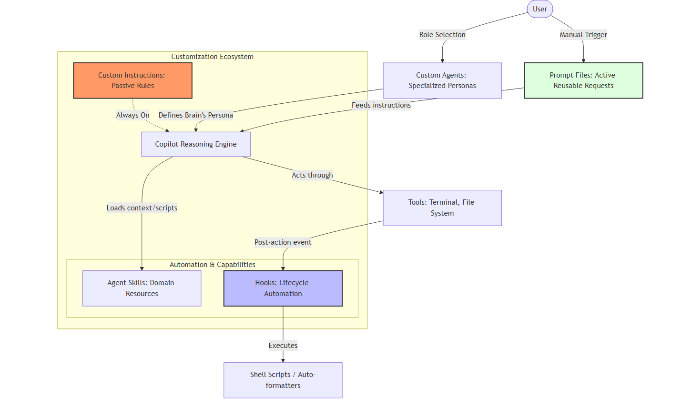

# GitHub Copilot Agent Customization: Advanced Study Guide

This document serves as a comprehensive reference for customizing GitHub Copilot in VS Code. It covers the advanced features of "Agent-First Development" focusing on tailoring AI behavior, automating workflows, and building specialized personas.

---

## Diagram

This diagram visualizes how the different customization layers (Instructions, Prompts, Agents, Skills, and Hooks) interact with each other and the core AI engine within VS Code.

# Prompts

## Solid Principles

/create-instructions please create instructions for this workspace for applying solid principles for javascript while writing or refactoring the code. After aplying solid principle during code generation or refactoring, which principle(s) were applied and where.

## 1. Agent Customizations UI

The **Customizations UI** is the "Mission Control" for your AI workflows in VS Code. It provides a centralized dashboard where you can manage all instructions, skills, agents, prompts, and hooks without digging through hidden folders.

- **Access:** Accessible via the command palette (`Chat: Customizations`) or the gear icon in the Copilot Chat panel.
- **Purpose:** It simplifies the creation and management of complex AI configurations and allows you to "generate" new customization files directly from a chat prompt.

[Image of GitHub Copilot Customization UI in VS Code]

## 2. Custom Instructions (Passive Rules)

**Custom Instructions** act as a persistent "Rule Book" for the AI. These are Markdown files that define coding standards, naming conventions, and architectural patterns that the AI must follow in every interaction.

- **Functionality:** Unlike prompts that you send manually, instructions are "Passive"—they are always on in the background.
- **Example:** You can set a rule to "Always follow SOLID principles" or "Ensure all UI code meets WCAG accessibility standards." The AI will automatically analyze and refactor code against these rules.

[Image of a flowchart showing Custom Instructions influencing AI code generation]

## 3. Agent Skills (Specialized Capabilities)

**Agent Skills** are portable folders containing instruction files, scripts, and resources. They follow an open standard, meaning a skill created for VS Code can also work in the Copilot CLI or Cloud.

- **Structure:** A skill typically contains a `skill.md` file (defining its purpose) and associated scripts or templates.
- **Utility:** Skills allow the AI to perform specialized tasks like "Update README whenever a feature is added" or "Create a reusable prompt template."

[Image of the file structure for a GitHub Copilot Agent Skill]

## 4. Custom Agents (Domain Personas)

**Custom Agents** allow you to configure the AI to adopt specific personas tailored to a role. Instead of a general-purpose assistant, you interact with a specialized expert.

- **Personas:** Examples include a `Security Reviewer` (focusing on vulnerabilities), a `Solution Architect`, or a `Domain Expert` (e.g., an "Arcade App Builder" that knows specific retro-theme CSS).
- **Configuration:** Each agent has its own set of system instructions, available tools, and behavior rules.

[Image of a diagram comparing a General AI Assistant vs. Specialized Custom Agents]

## 5. Hooks (Lifecycle Automation)

**Hooks** enable the execution of custom shell commands at specific lifecycle points during an agent session. They "quietly handle work in the background" to ensure your environment stays in a desired state.

- **Lifecycle Events:** Common events include `start-session`, `user-prompt-submit`, and `post-tool-use`.
- **Standard Use Case:** A `post-tool-use` hook can be set to run a formatter like **Prettier** every time the AI finishes editing a file, ensuring code is always styled correctly.

[Image of a sequence diagram showing a Hook triggering after an AI tool action]

## 6. Prompt Files (Active Reusable Requests)

**Prompt Files** are `.prompt.md` files that store complex, repeatable, or parameterized requests. They are "Active" customizations because you trigger them manually using the `/` command.

- **When to use:** Use prompt files for tasks you repeat across different files or projects, such as "Quiz me on this code" or "Simplify this bloated logic."
- **Benefit:** They eliminate the need to re-write long, detailed prompts, ensuring consistent AI behavior and faster workflows.

[Image of a comparison chart between Passive Custom Instructions and Active Prompt Files]

## 7. Comparison: Understanding the Workflow

To use these tools effectively, you must understand their relationship and scope:

| Feature          | Scope      | Interaction                     | Best For                                       |
| :--------------- | :--------- | :------------------------------ | :--------------------------------------------- |
| **Instructions** | Background | Passive (Always on)             | Enforcing standards (SOLID, Accessibility).    |
| **Prompt Files** | Manual     | Active (User-triggered)         | Repeatable tasks (Code review, Unit tests).    |
| **Agents**       | Chat/Role  | Interactive (Persona)           | Specialized domain experts (Security, UI).     |
| **Skills**       | Tool-based | Contextual (Loaded when needed) | Adding new capabilities (README updates).      |
| **Hooks**        | Lifecycle  | Automatic (Triggered by events) | Environment maintenance (Formatting, Linting). |

## 8. Integrated Practice: Building a Repo Analyzer

The "Ep 8" demo combines all features into a single workflow to build a **Repo Analyzer** app:

- **Custom Agent:** Uses the "Arcade App Builder" to maintain a consistent retro aesthetic.
- **Custom Instructions:** Ensures all code follows SOLID principles and WCAG accessibility.
- **Agent Skill:** Automatically updates the `README.md` as features are added or removed.
- **Prompt File:** Used to identify "dead code" or bloated logic in the repository.
- **Hook:** Automatically runs a code formatter every time the AI modifies the analyzer's script.

---

### References

- [Agent Customizations UI](https://www.youtube.com/watch?v=AZzCk-WGks4)
- [Custom Instructions Mastery](https://www.youtube.com/watch?v=dk2biPguo_E)
- [Agent Skills Deep Dive](https://www.youtube.com/watch?v=mPjTZviv23s)
- [Building Custom Agents](https://www.youtube.com/watch?v=Y7MPeZTIgqo)
- [Automating with Hooks](https://www.youtube.com/watch?v=ZsyiRa91XZg)
- [Prompt Files vs. Prompting](https://www.youtube.com/watch?v=d37Y28uU2JY)
- [Comparison & Quiz Strategy](https://www.youtube.com/watch?v=oyMMotLlcgQ)
- [Full Implementation Demo](https://www.youtube.com/watch?v=Bb45ZoKfJf0)
