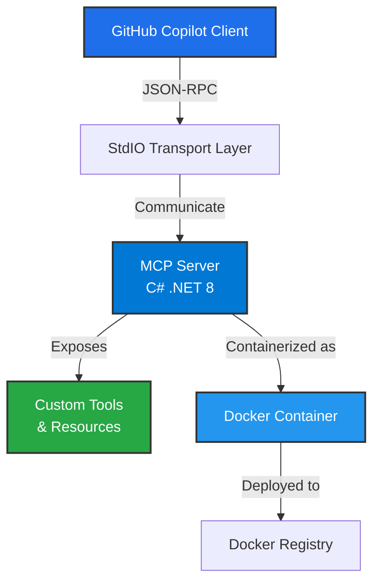
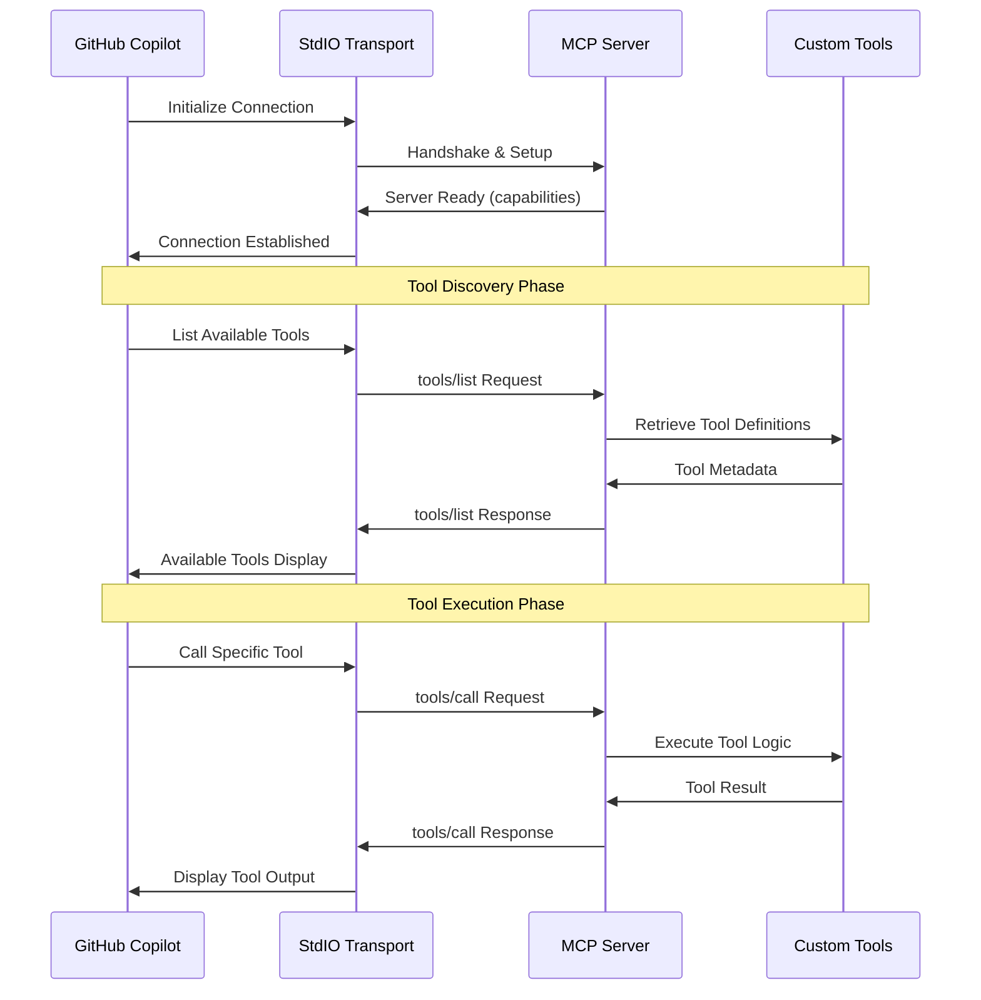
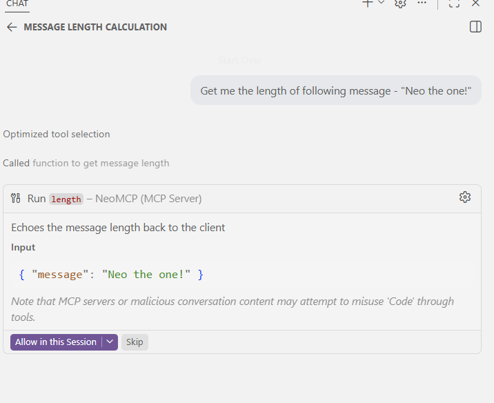
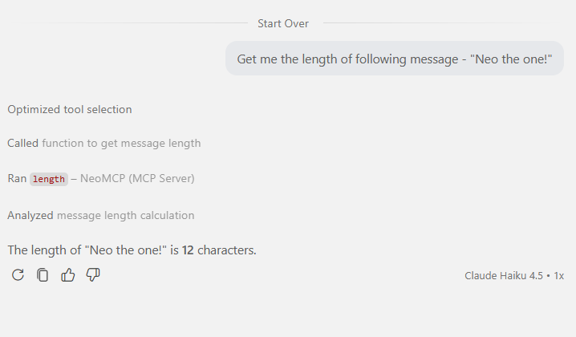
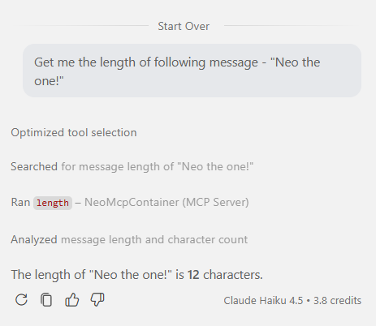
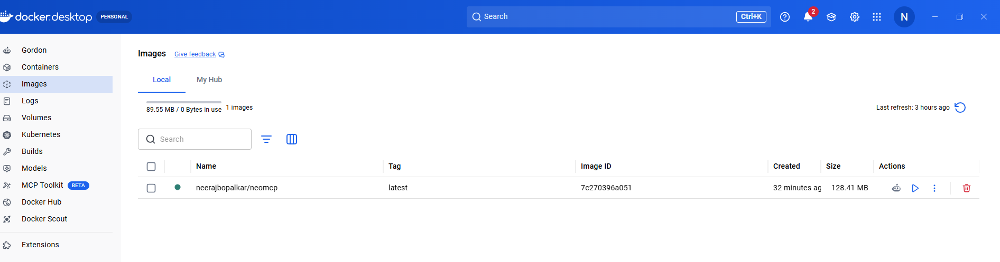
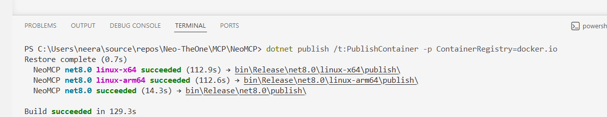
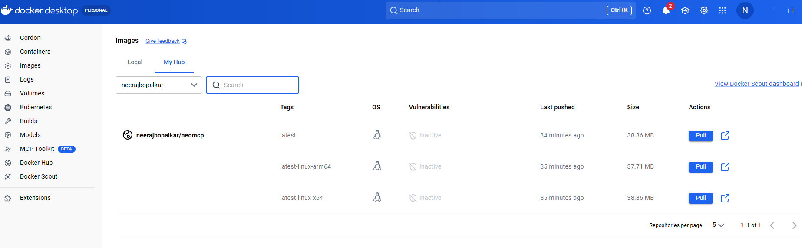

# 🔌 Building Model Context Protocol (MCP) Server

Build Model Context Protocol (MCP) server with C#.

## Overview

This project explores how to build MCP server with a C# SDK.

## Implementation Architecture

### Component Diagram

The MCP Server architecture consists of the following components:

### Sequence Diagram

The interaction flow between GitHub Copilot and the MCP Server:

### Implementation Details

**MCP Server (C# .NET 8)**
- Implements the Model Context Protocol using the official C# SDK
- Exposes custom tools as JSON-RPC methods
- Handles bidirectional communication via StdIO transport
- Manages server lifecycle and tool registration

**Tool Definitions**
- Each tool is defined with input schema, description, and implementation logic
- Tools are discoverable by GitHub Copilot through the protocol
- Supports complex input validation and response formatting

**Containerization**
- Server is packaged as a Docker image for easy deployment
- Docker image can be run locally or pushed to a Docker Registry
- Enables seamless integration with GitHub Copilot configuration

**Integration Flow**
1. MCP Server starts and listens on StdIO
2. GitHub Copilot connects and discovers available tools
3. User invokes tools through Copilot interface
4. Copilot sends JSON-RPC requests to the server
5. Server executes the tool logic and returns results
6. Results are displayed back to the user in Copilot

## References

- [(11) Beginner's Guide to Building a MCP Server with C# and .NET - YouTube](https://www.youtube.com/watch?v=MKD-sCZWpZQ&t=45s)
- [GitHub - modelcontextprotocol/csharp-sdk: The official C# SDK for Model Context Protocol servers and clients. Maintained in collaboration with Microsoft. · GitHub](https://github.com/modelcontextprotocol/csharp-sdk)
- [C# MCP SDK announcement](https://developer.microsoft.com/blog/microsoft-partners-with-anthropic-to-create-official-c-sdk-for-model-context-protocol)
- [jamesmontemagno docker repository](https://hub.docker.com/u/jamesmontemagno)

## Results - Tools running with dotnet run command

- MCP Server started successfully and tools are available for GH Copilot to use

## Results - Hard coded tools running with docker run command 
Tool called successfully

Docker image running on local

Docker image pushed successfully to registry

