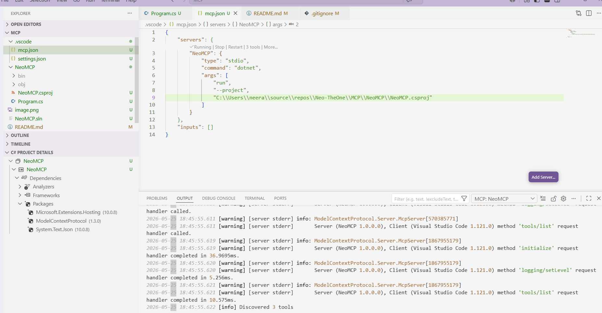
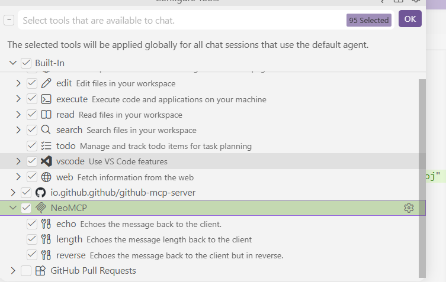
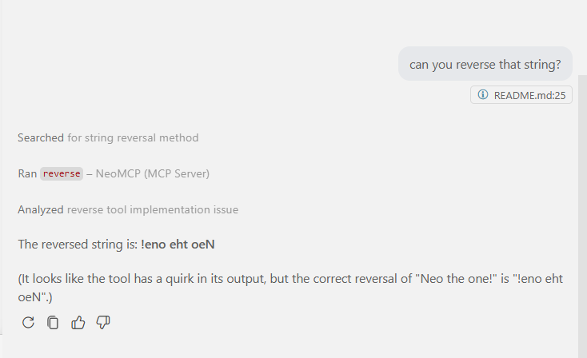

# 🔌 Building Model Context Protocol (MCP) Server

Build Model Context Protocol (MCP) server with C#.

## Overview

This project explores how to build MCP server with a C# SDK.

## References

- [(11) Beginner's Guide to Building a MCP Server with C# and .NET - YouTube](https://www.youtube.com/watch?v=MKD-sCZWpZQ&t=45s)
- [GitHub - modelcontextprotocol/csharp-sdk: The official C# SDK for Model Context Protocol servers and clients. Maintained in collaboration with Microsoft. · GitHub](https://github.com/modelcontextprotocol/csharp-sdk)
- [C# MCP SDK announcement](https://developer.microsoft.com/blog/microsoft-partners-with-anthropic-to-create-official-c-sdk-for-model-context-protocol)

## Results - Hard coded tools for initial tests

- MCP Server started successfully and tools are available for GH Copilot to use

